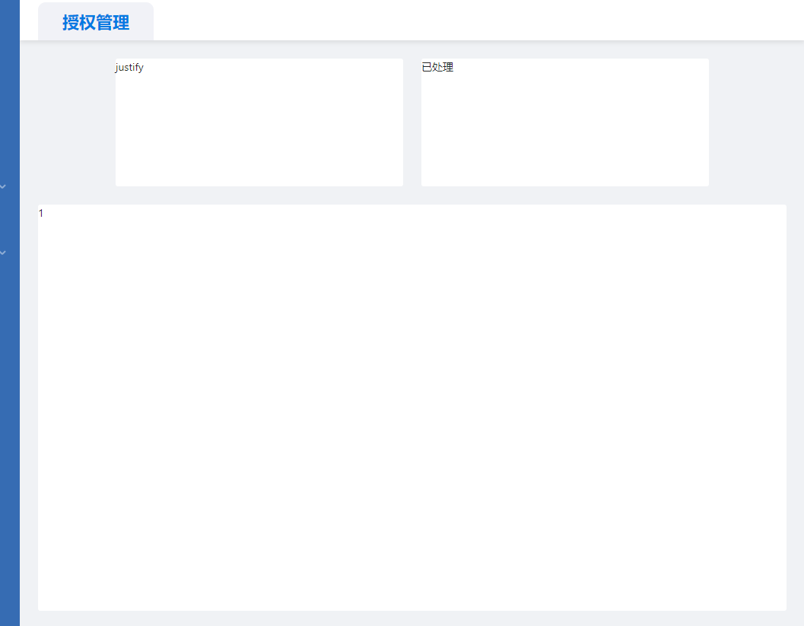

# flex

针对遇到的样式布局问题产生的关于 flex 的查补。
在项目中遇到了要实现如下布局，上方元素的高度是确定的，下方元素的高度不确定，此时采用纵向 flex 布局，然后针对下方元素采用 flex:1;规定该项目相对于其余弹性项目的增长量。就能实现效果。


```html
<div className="dashboard">
  <div className="cardList">
    <div className="card">justify</div>
    <div className="card">已处理</div>
  </div>
  <div className="message">1</div>
</div>
```

```css
.dashboard {
  height: 100%;
  width: 100%;
  display: flex;
  flex-direction: column;
}
.cardList {
  display: flex;
  justify-content: center;
}
.card {
  margin: 0 12px 0 12px;
  width: 378px;
  height: 168px;
  background: #ffffff;
  border-radius: 3px;
}
.message {
  flex: 1;
  margin-top: 24px;
  background: #ffffff;
  border-radius: 3px;
}
```
# 样式覆盖
由于要修改antd的默认样式，针对所有的组件进行重写和写style非常不现实。
采用>选择器和!important来针对css的优先级进行设置，使得样式可以按需覆盖。
```css
.ant-menu-submenu-open > .ant-menu-submenu-title {
  margin-bottom: 30px;
  padding-left: 35px !important;
  width: 100%;
  font-size: 22px;
  font-weight: 400;
  height: 57px !important;
  background: #204e97;
  color: #ffffff !important;
}
```